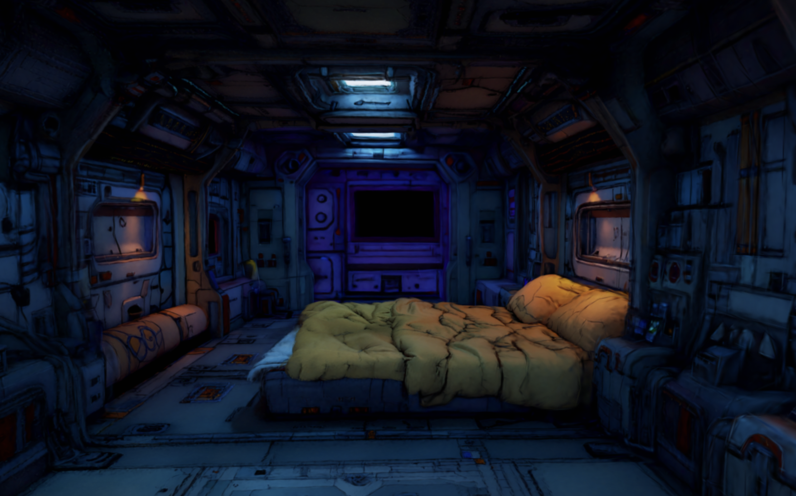

# Spark LOD Stream

A minimal example project demonstrating Gaussian splat streaming with [SparkJS](https://github.com/sparkjsdev/spark). Features progressive LOD (Level of Detail) loading, VR support, and mobile touch controls.

## Live Demo

[https://sparklodstream.netlify.app/](https://sparklodstream.netlify.app/)

## Features

- **Streaming LOD**: Progressively loads splat chunks (`-lod-0.spz`, `-lod-1.spz`, etc.) based on camera distance
- **VR Support**: WebXR with hand tracking via `SparkXr`
- **Mobile Controls**: Virtual joystick for touch devices
- **Desktop Controls**: WASD/arrow keys + mouse look via `SparkControls`

## Setup

```bash
npm install
npm run dev
```

## Build and Deploy

```bash
npm run build
npx netlify-cli deploy --prod --dir=dist
```

## Usage

To enable streaming for your own splats, use the `paged: true` option with a `-lod-0.spz` URL:

```javascript
const splat = new SplatMesh({ 
  url: "https://your-cdn.com/scene-lod-0.spz",
  paged: true,
});
```

The system will automatically fetch `-lod-1.spz`, `-lod-2.spz`, etc. as needed.

## Project Structure

```
index.html          - Entry point
main.js             - Scene setup, controls, animation loop
mobile-controls.js  - Virtual joystick for touch devices
lib/                - Local Spark build
  spark.module.js
  spark.module.js.map
  spark_internal_rs_bg.wasm
```

## Updating Spark

To update the local Spark build from `~/projects/spark/`:

```bash
./update-spark.sh
```

## License

MIT
